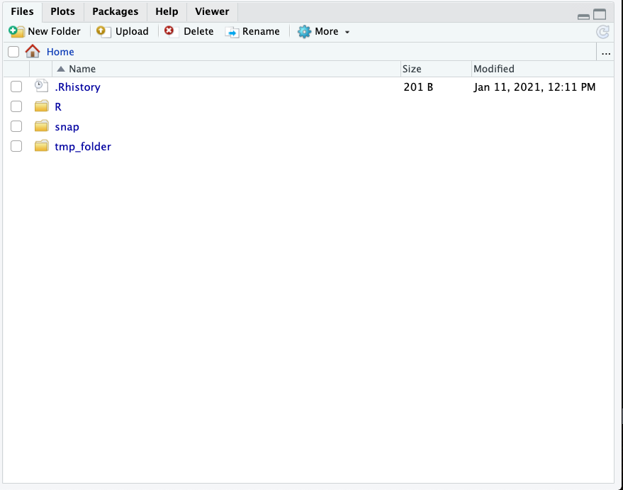

*Most of these notes expand on what I learned from [Grant McDermott](http://grantmcdermott.com/) in his very helpful [course](https://github.com/uo-ec607-2019winter/lectures). I am also grateful to [Ed Rubin](http://edrub.in/) for the constant help with all of my R-related troubles. *

## Overview


This is a short guide that demonstrates how to set up a GCE instance with Rstudio, __and__ setup storage via Google Storage. I found a lot of information on setting up an instance with Rstudio and how to `mount a bucket' -- but nothing that gave explicit steps on how to combine the two, in a beginner-friendly way. I am 100% sure that there are better ways to demonstrate what I show here. Any comments are welcome and appreciated!

This guide assumes you have already set up a VM instance and know how to launch Rstudio with GCE. If not, follow this great [guide](https://raw.githack.com/uo-ec607/lectures/master/14-gce/14-gce.html#requirements) from Grant McDermott. 

## 0. __Setting Up__

First set up your VM, following Grant's notes. Launch it, SSH in. Let's assume you have created a VM called `rstudio`. We now want to set up a project with longer-term storage -- for this, we will use [Google Cloud Storage](https://cloud.google.com/storage) and [GCS fuse](https://cloud.google.com/storage/docs/gcs-fuse). Buckets are where we store our data (and anything else). For storage pricing, see [here](https://cloud.google.com/storage/pricing).

Our goal is to "mount" a bucket to the VM.[^1] This will allow us to access any files in the bucket every time we fire up the VM.


Now, fire up your Rstudio console within the VM you just created, using <external-ip:8787> in your browser. 


## 1. __Install GCS fuse__  

By following [this guide](apt-get install gcsfuse). The following code is for VMs set up with the latest releases of Ubuntu and Debian. In this case, my username that I created for Rstudio is `johnm` and the VM name is `rstudio`. 


```
johnm@rstudio:~$ export GCSFUSE_REPO=gcsfuse-`lsb_release -c -s`
johnm@rstudio:~$ echo "deb http://packages.cloud.google.com/apt $GCSFUSE_REPO main" | sudo tee /etc/apt/sources.list.d/gcsfuse.list
johnm@rstudio:~$ curl https://packages.cloud.google.com/apt/doc/apt-key.gpg | sudo apt-key add -
johnm@rstudio:~$ apt-get update
johnm@rstudio:~$ apt-get install gcsfuse
```

## 2. __Create a bucket__

As with everything here, this can be done directly in the Google Cloud Console or the terminal. We will use the command [`gsutil mb`](https://cloud.google.com/storage/docs/creating-buckets). See the documentation for more options. __Note__ bucket names are unique across cloud-storage, so you will have to create a bucket with a different name.[^2] I will call mine `johnm-testbucket`


```
johnm@rstudio:~$ gsutil mb -c STANDARD -l  US-WEST1 gs://johnm-testbucket
```


Now you should be able to go to the cloud console and confirm that the bucket is there:


## 3. __Mount the bucket.__ 

Next, we need to "mount" this bucket to our VM instance. This is straightforward enough. The goal here is to be able to access all of the contents of "johnm-testbucket" (currently empty) in Rstudio. First, create a folder for the contents of the bucket:

```
johnm@rstudio:~$ mkdir tmp_folder
```

You should see this pop up in the Rstudio console you just opened up.




Finally, we can mount the bucket (named `johnmm-testbucket`) using: 

```
johnm@rstudio:~$gcsfuse johnm-testbucket tmp_folder
```


Great, we can now use the contents of `johnm-testbucket` -- which is currently empty. 


## Bonus: Copying files from local to the bucket


Now that we have mounted our bucket to our VM instance, we might want to move some data into the folder. This again can be done directly with the Google Console or the terminal. I'll upload a folder via the terminal using the [`gsutil cp`](https://cloud.google.com/storage/docs/uploading-objects) command. Suppose I have a folder on my desktop called `important_data` (that has a few .csv files in it). I can upload this to `johnm-testbucket` via:

```
Johns-MacBook-Pro:~ johnm$ gsutil cp -r /Users/johnm/Desktop/important_data/*.csv gs://johnm-testbucket
```

__Note:__ This needs to be done in a separate terminal (not with `johnm@rstudio`). Let's confirm that our csv files have made it in:


Great! Now you can stop your VM and when you fire it back up, `tmp_folder` should still be there. One other thing: initially I tried loading an entire directory to a bucket and ran into some issues. This is a bad [idea](https://stackoverflow.com/questions/38311036/folders-not-showing-up-in-bucket-storage). However, as the top answer suggests, you can workaround this by using the `--implicit-dirs` flag, at latency cost. 


Again, there are probably much better and more efficient ways to do what I have done here, but I wanted to write something that was very beginner-friendly. I hope you find this useful and please let me know if you have any suggestions. 


 [^1]: If anybody knows the origins of this verbiage, I would be very curious to hear.
 
 [^2]: You may run into permission issues here. If so use `johnm@rstudio:~$ gcloud auth login`
 
 
